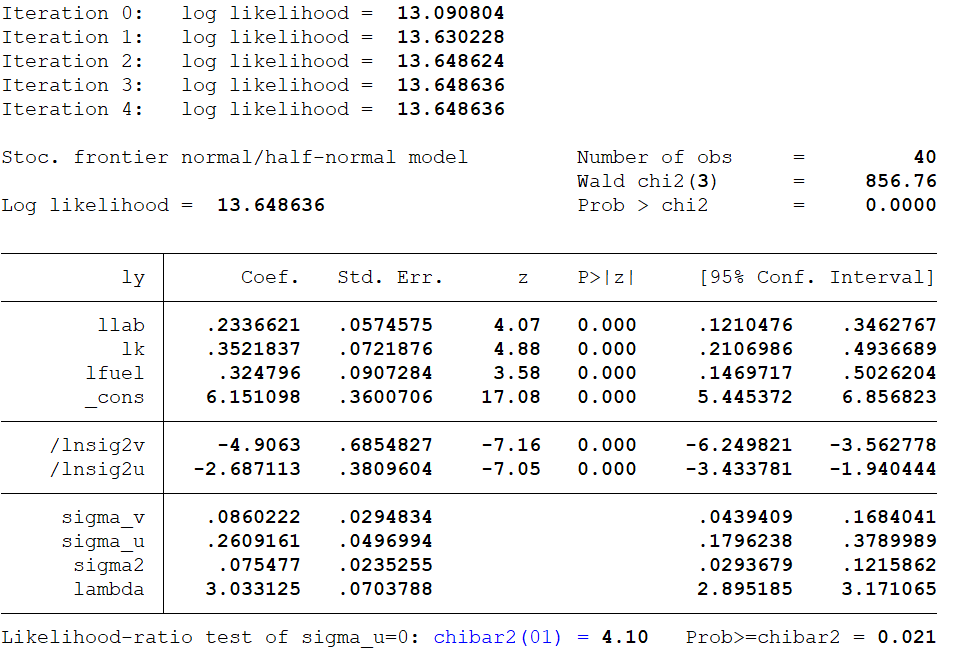
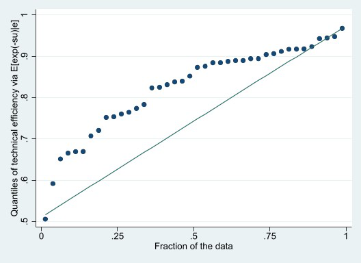
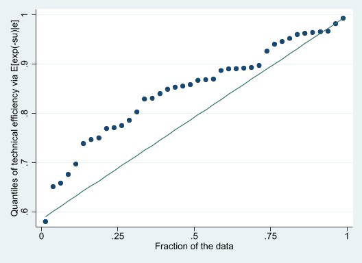
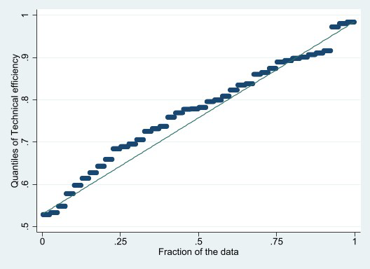

Econometric approach to efficiency analysis Project

\-

Electricity production

> Benjamin Clouet∗ Bruce Ravey†
>
> *Toulouse School of Economics* *Toulouse School of Economics*

April 14, 2023

**Abstract**

> The present study examines productivity in electricity generation
> across 40 companies over a period of six years, with a focus on the
> relationship between input variables like capital assets, workforce
> and maintenance, and fuel consumption in relation to the net
> generation of steam electric power. The research delves into the
> effects of various input costs, such as workforce and maintenance
> expenditures, fuel pricing, and the value of capital assets, on the
> operational efficiency of these firms. Leveraging a detailed dataset
> with company-specific information and a range of productivity
> evaluation techniques like cross-sectional and panel data analyses,
> the study aims to pinpoint the key factors that drive productivity in
> the power sector. The results will provide valuable guidance for
> policy suggestions and strategic choices to improve the overall
> performance and sustainability of the energy industry, benefiting
> policymakers, industry stakeholders, and academics alike.
>
> **Keywords:** Econometric approach to efficiency analysis ;
> Electricity Production Data Set
>
> ∗Available through benjamin.clouet@ut-capitole.fr.\
> †Available through bruce.ravey@ut-capitole.fr.

**Contents**

+-------------+-------------+-------------+-------------+-------------+
| **1**       | > **Int     |             |             | **1**       |
|             | roduction** |             |             |             |
+=============+=============+=============+=============+=============+
| **2**       | > **DEA     |             |             | **2**       |
|             | >           |             |             |             |
|             |  Analysis - |             |             |             |
|             | > Cross-    |             |             |             |
|             | sectional** |             |             |             |
+-------------+-------------+-------------+-------------+-------------+
| **3**       | 2.1         | Input and   | . . . . . . | 2           |
|             |             | Output      | . . . . . . |             |
|             |             | oriented    | . . . . . . |             |
|             |             | Analysis    | . . . . . . |             |
|             |             |             | . . . . . . |             |
|             |             |             | . .         |             |
+-------------+-------------+-------------+-------------+-------------+
|             | 2.2         | Cost        |             | 6           |
|             |             | efficiency  |             |             |
|             |             | analysis :  |             |             |
|             |             | . . . . . . |             |             |
|             |             | . . . . . . |             |             |
|             |             | . . . . . . |             |             |
|             |             | . . . . . . |             |             |
|             |             | . . . . . . |             |             |
|             |             | . . . . . . |             |             |
|             |             | . . .       |             |             |
+-------------+-------------+-------------+-------------+-------------+
|             | > **SFA     |             |             | **9**       |
|             | >           |             |             |             |
|             |  Analysis - |             |             |             |
|             | > Cross-    |             |             |             |
|             | sectional** |             |             |             |
+-------------+-------------+-------------+-------------+-------------+
| **4**       | > **SFA     |             |             | **12**      |
|             | >           |             |             |             |
|             |  Analysis - |             |             |             |
|             | > Panel     |             |             |             |
|             | > Data**    |             |             |             |
+-------------+-------------+-------------+-------------+-------------+

**1** **Introduction**

A reliable and consistent electricity supply is essential for the growth
and stability of the global economy. The effectiveness of electricity
generation has attracted the attention of decision-makers, researchers,
and industry participants, as it directly influences the overall
performance and sustainability of the energy sector. This research
project aims to perform an assessment of productivity in electricity
generation across 40 firms over a 6-year period.

The focus of this analysis is to explore the connection between input
variables such as capital assets, workforce and maintenance, and fuel,
and their influence on the net production of steam electric power.
Moreover, the research will delve into the impact of input costs,
including labor and maintenance expenses, fuel prices, and capital asset
values, on the efficiency of the firms' operations. This investigation
will help to pinpoint the primary drivers of productivity and provide
valuable insights for policy recommendations and strategic decisions to
improve the overall performance of the power sector.

> The dataset used for this research contains the following variables:
>
> • Firm identifier (firm): A unique code for each of the 40 firms
> included in the dataset.
>
> • Year (year): The year of observation, covering a 6-year period.
>
> • Output - net steam electric power (y): The net production of steam
> electric power generated by the firm, quantified in megawatt-hours
> (MWh).
>
> • Capital assets (k): The input variable representing the capital
> assets employed in electricity generation.
>
> • Workforce and maintenance (labor): The input variable representing
> the workforce and maintenance efforts for electricity generation.
>
> • Fuel (fuel): The input variable representing the quantity of fuel
> utilized in electricity generation.
>
> • Labor and maintenance cost (wl): The cost of the workforce and
> maintenance input.
>
> • Fuel cost (wf): The cost of the fuel input.
>
> • Capital asset value (wk): The value of the capital asset input.

Employing these variables, the research will utilize various
productivity assessment methods, such as cross-sectional analysis, panel
data analysis, to estimate the productivity of the electricity
generation process for each firm and over time. The outcomes of this
analysis will enhance our understanding of the factors affecting
production efficiency in the power sector and offer valuable insights
for decision-makers, industry participants, and researchers.

1

**2** **DEA Analysis - Cross-sectional**

**2.1** **Input and Output oriented Analysis**

The efficiency summaries provided display one table demonstrating
input-oriented efficiency and the other showcasing output-oriented
efficiency. Each table lists firms along with their efficiency
measurements: constant returns to scale (CRSTE), variable returns to
scale (VRSTE), and scale efficiency (scale). Addi-tionally, the tables
show whether the firms experience increasing returns to scale (IRS),
decreasing returns to scale (DRS), or constant returns to scale (-)
based on their scale efficiency.

Input-oriented efficiency evaluates how effectively a company can reduce
its inputs while maintaining a steady output level. In contrast,
output-oriented efficiency measures how well a company can increase its
outputs while keeping its inputs constant. The primary distinction
between the two methods is whether the focus is on minimizing inputs or
maximizing outputs to achieve efficiency.

Analyzing the input-oriented efficiency summary:\
The average CRSTE, VRSTE, and scale efficiency values are 0.813, 0.867,
and 0.939, respectively. This suggests that firms can potentially
decrease their inputs by about 18.7% (1 - 0.813) on average, while
keeping output levels unchanged. The most efficient firms have CRSTE,
VRSTE, and scale efficiency values of 1. These companies are already
functioning at optimal efficiency levels (for example, firms 25, 29, 31,
34, and 37). Companies with DRS (such as firm 1) can enhance their
efficiency by reducing their scale of operations, while those with IRS
(such as firm 3) can improve efficiency by expanding their scale of
operations.

Examining the output-oriented efficiency summary:\
The average CRSTE, VRSTE, and scale efficiency values are 0.813, 0.885,
and 0.917, respectively. This implies that firms can potentially
increase their outputs by approximately 18.7% (1 - 0.813) on average
while maintaining constant input levels. The most efficient firms have
CRSTE, VRSTE, and scale efficiency values of 1. These companies are
already functioning at optimal efficiency levels (for example, firms 25,
29, 31, 34, and 37). The key difference between the two tables is the
emphasis of the efficiency measure. Input-oriented efficiency
prioritizes minimizing inputs to reach efficiency, while output-oriented
efficiency centers on maximizing outputs. Nevertheless, in both tables,
the overall interpretation of the efficiency measurements is consistent.
Factories with efficiency values of 1 are operating at their best, while
others can improve their efficiency by adjusting their scale of
operations.

2

Table 1: Efficiency Summary (Input and Output Oriented)

+--------+--------+--------+--------+--------+--------+--------+--------+
| Firm   | >      | > *    |        | Firm   | > **   |        |        |
|        |  CRSTE | *Input |        |        | Output |        |        |
|        |        | > Orie |        |        | > Orie |        |        |
|        |        | nted** |        |        | nted** |        |        |
+========+========+========+========+========+========+========+========+
|        |        | >      | >      |        | CRSTE  | VRSTE  | >      |
|        |        |  VRSTE |  Scale |        |        |        |  Scale |
+--------+--------+--------+--------+--------+--------+--------+--------+
| 1      | 0.864  | 0.884  | >      | 1      | 0.864  | 0.895  | >      |
|        |        |        |  0.977 |        |        |        |  0.965 |
|        |        |        | > drs  |        |        |        | > drs  |
+--------+--------+--------+--------+--------+--------+--------+--------+
| 2      | 0.780  | 0.791  | >      | 2      | 0.780  | 0.862  | >      |
|        |        |        |  0.986 |        |        |        |  0.905 |
|        |        |        | > drs  |        |        |        | > drs  |
+--------+--------+--------+--------+--------+--------+--------+--------+
| 3      | 0.928  | 0.930  | >      | 3      | 0.928  | 0.928  | >      |
|        |        |        |  0.998 |        |        |        |  0.999 |
|        |        |        | > irs  |        |        |        | > irs  |
+--------+--------+--------+--------+--------+--------+--------+--------+
| 4      | 0.804  | 0.806  | >      | 4      | 0.804  | 0.807  | >      |
|        |        |        |  0.998 |        |        |        |  0.996 |
|        |        |        | > irs  |        |        |        | > drs  |
+--------+--------+--------+--------+--------+--------+--------+--------+
| 5      | 0.807  | 0.869  | >      | 5      | 0.807  | 0.879  | >      |
|        |        |        |  0.928 |        |        |        |  0.918 |
|        |        |        | > drs  |        |        |        | > drs  |
+--------+--------+--------+--------+--------+--------+--------+--------+
| 6      | 0.860  | 0.931  | >      | 6      | 0.860  | 0.935  | >      |
|        |        |        |  0.923 |        |        |        |  0.919 |
|        |        |        | > drs  |        |        |        | > drs  |
+--------+--------+--------+--------+--------+--------+--------+--------+
| 7      | 0.863  | 0.908  | >      | 7      | 0.863  | 0.913  | >      |
|        |        |        |  0.951 |        |        |        |  0.946 |
|        |        |        | > drs  |        |        |        | > drs  |
+--------+--------+--------+--------+--------+--------+--------+--------+
| 8      | 0.548  | 0.805  | >      | 8      | 0.548  | 0.858  | >      |
|        |        |        |  0.682 |        |        |        |  0.639 |
|        |        |        | > drs  |        |        |        | > drs  |
+--------+--------+--------+--------+--------+--------+--------+--------+
| 9      | 0.691  | 0.760  | >      | 9      | 0.691  | 0.853  | >      |
|        |        |        |  0.909 |        |        |        |  0.810 |
|        |        |        | > drs  |        |        |        | > drs  |
+--------+--------+--------+--------+--------+--------+--------+--------+
| 10     | 0.813  | 0.820  | >      | 10     | 0.813  | 0.817  | >      |
|        |        |        |  0.992 |        |        |        |  0.995 |
|        |        |        | > irs  |        |        |        | > irs  |
+--------+--------+--------+--------+--------+--------+--------+--------+
| 11     | 0.794  | 1.000  | >      | 11     | 0.794  | 1.000  | >      |
|        |        |        |  0.794 |        |        |        |  0.794 |
|        |        |        | > drs  |        |        |        | > drs  |
+--------+--------+--------+--------+--------+--------+--------+--------+
| 12     | 0.877  | 1.000  | >      | 12     | 0.877  | 1.000  | >      |
|        |        |        |  0.877 |        |        |        |  0.877 |
|        |        |        | > drs  |        |        |        | > drs  |
+--------+--------+--------+--------+--------+--------+--------+--------+
| 13     | 0.874  | 0.905  | >      | 13     | 0.874  | 0.937  | >      |
|        |        |        |  0.966 |        |        |        |  0.933 |
|        |        |        | > drs  |        |        |        | > drs  |
+--------+--------+--------+--------+--------+--------+--------+--------+
| 14     | 0.691  | 0.898  | >      | 14     | 0.691  | 0.928  | >      |
|        |        |        |  0.769 |        |        |        |  0.744 |
|        |        |        | > drs  |        |        |        | > drs  |
+--------+--------+--------+--------+--------+--------+--------+--------+
| 15     | 0.740  | 0.894  | >      | 15     | 0.740  | 0.904  | >      |
|        |        |        |  0.828 |        |        |        |  0.819 |
|        |        |        | > drs  |        |        |        | > drs  |
+--------+--------+--------+--------+--------+--------+--------+--------+
| 16     | 0.680  | 0.694  | >      | 16     | 0.680  | 0.733  | >      |
|        |        |        |  0.979 |        |        |        |  0.928 |
|        |        |        | > drs  |        |        |        | > drs  |
+--------+--------+--------+--------+--------+--------+--------+--------+
| 17     | 0.603  | 0.608  | >      | 17     | 0.603  | 0.604  | >      |
|        |        |        |  0.992 |        |        |        |  0.998 |
|        |        |        | > irs  |        |        |        | > irs  |
+--------+--------+--------+--------+--------+--------+--------+--------+
| 18     | 0.729  | 0.739  | >      | 18     | 0.729  | 0.734  | >      |
|        |        |        |  0.987 |        |        |        |  0.994 |
|        |        |        | > irs  |        |        |        | > irs  |
+--------+--------+--------+--------+--------+--------+--------+--------+
| 19     | 0.401  | 0.447  | >      | 19     | 0.401  | 0.608  | >      |
|        |        |        |  0.897 |        |        |        |  0.660 |
|        |        |        | > drs  |        |        |        | > drs  |
+--------+--------+--------+--------+--------+--------+--------+--------+
| 20     | 0.966  | 1.000  | >      | 20     | 0.966  | 1.000  | >      |
|        |        |        |  0.966 |        |        |        |  0.966 |
|        |        |        | > irs  |        |        |        | > irs  |
+--------+--------+--------+--------+--------+--------+--------+--------+
| 21     | 0.981  | 1.000  | >      | 21     | 0.981  | 1.000  | >      |
|        |        |        |  0.981 |        |        |        |  0.981 |
|        |        |        | > drs  |        |        |        | > drs  |
+--------+--------+--------+--------+--------+--------+--------+--------+
| 22     | 0.884  | 0.958  | >      | 22     | 0.884  | 0.960  | >      |
|        |        |        |  0.923 |        |        |        |  0.921 |
|        |        |        | > drs  |        |        |        | > drs  |
+--------+--------+--------+--------+--------+--------+--------+--------+
| 23     | 0.981  | 1.000  | >      | 23     | 0.981  | 1.000  | >      |
|        |        |        |  0.981 |        |        |        |  0.981 |
|        |        |        | > irs  |        |        |        | > irs  |
+--------+--------+--------+--------+--------+--------+--------+--------+
| 24     | 0.847  | 1.000  | >      | 24     | 0.847  | 1.000  | >      |
|        |        |        |  0.847 |        |        |        |  0.847 |
|        |        |        | > drs  |        |        |        | > drs  |
+--------+--------+--------+--------+--------+--------+--------+--------+
| 25     | 1.000  | 1.000  | >      | 25     | 1.000  | 1.000  | >      |
|        |        |        |  1.000 |        |        |        |  1.000 |
|        |        |        | > -    |        |        |        | > -    |
+--------+--------+--------+--------+--------+--------+--------+--------+
| 26     | 0.586  | 0.587  | >      | 26     | 0.586  | 0.634  | >      |
|        |        |        |  0.998 |        |        |        |  0.924 |
|        |        |        | > irs  |        |        |        | > drs  |
+--------+--------+--------+--------+--------+--------+--------+--------+
| 27     | 0.861  | 1.000  | >      | 27     | 0.861  | 1.000  | >      |
|        |        |        |  0.861 |        |        |        |  0.861 |
|        |        |        | > irs  |        |        |        | > irs  |
+--------+--------+--------+--------+--------+--------+--------+--------+
| 28     | 0.993  | 0.999  | >      | 28     | 0.993  | 0.999  | >      |
|        |        |        |  0.994 |        |        |        |  0.994 |
|        |        |        | > irs  |        |        |        | > irs  |
+--------+--------+--------+--------+--------+--------+--------+--------+
| 29     | 1.000  | 1.000  | >      | 29     | 1.000  | 1.000  | >      |
|        |        |        |  1.000 |        |        |        |  1.000 |
|        |        |        | > -    |        |        |        | > -    |
+--------+--------+--------+--------+--------+--------+--------+--------+
| 30     | 0.782  | 0.789  | >      | 30     | 0.782  | 0.805  | >      |
|        |        |        |  0.992 |        |        |        |  0.971 |
|        |        |        | > drs  |        |        |        | > drs  |
+--------+--------+--------+--------+--------+--------+--------+--------+
| 31     | 1.000  | 1.000  | >      | 31     | 1.000  | 1.000  | >      |
|        |        |        |  1.000 |        |        |        |  1.000 |
|        |        |        | > -    |        |        |        | > -    |
+--------+--------+--------+--------+--------+--------+--------+--------+
| 32     | 0.791  | 0.822  | >      | 32     | 0.791  | 0.916  | >      |
|        |        |        |  0.963 |        |        |        |  0.864 |
|        |        |        | > drs  |        |        |        | > drs  |
+--------+--------+--------+--------+--------+--------+--------+--------+
| 33     | 0.560  | 0.562  | >      | 33     | 0.560  | 0.588  | >      |
|        |        |        |  0.996 |        |        |        |  0.953 |
|        |        |        | > irs  |        |        |        | > drs  |
+--------+--------+--------+--------+--------+--------+--------+--------+
| 34     | 1.000  | 1.000  | >      | 34     | 1.000  | 1.000  | >      |
|        |        |        |  1.000 |        |        |        |  1.000 |
|        |        |        | > -    |        |        |        | > -    |
+--------+--------+--------+--------+--------+--------+--------+--------+
| 35     | 0.760  | 1.000  | >      | 35     | 0.760  | 1.000  | >      |
|        |        |        |  0.760 |        |        |        |  0.760 |
|        |        |        | > drs  |        |        |        | > drs  |
+--------+--------+--------+--------+--------+--------+--------+--------+
| 36     | 0.705  | 0.781  | >      | 36     | 0.705  | 0.798  | >      |
|        |        |        |  0.903 |        |        |        |  0.883 |
|        |        |        | > drs  |        |        |        | > drs  |
+--------+--------+--------+--------+--------+--------+--------+--------+
| 37     | 1.000  | 1.000  | >      | 37     | 1.000  | 1.000  | >      |
|        |        |        |  1.000 |        |        |        |  1.000 |
|        |        |        | > -    |        |        |        | > -    |
+--------+--------+--------+--------+--------+--------+--------+--------+
| 38     | 0.819  | 0.827  | >      | 38     | 0.819  | 0.824  | >      |
|        |        |        |  0.990 |        |        |        |  0.993 |
|        |        |        | > irs  |        |        |        | > irs  |
+--------+--------+--------+--------+--------+--------+--------+--------+
| 39     | 0.671  | 0.673  | >      | 39     | 0.671  | 0.696  | >      |
|        |        |        |  0.998 |        |        |        |  0.965 |
|        |        |        | > irs  |        |        |        | > drs  |
+--------+--------+--------+--------+--------+--------+--------+--------+
| 40     | 0.971  | 0.996  | >      | 40     | 0.971  | 0.996  | >      |
|        |        |        |  0.975 |        |        |        |  0.975 |
|        |        |        | > drs  |        |        |        | > drs  |
+--------+--------+--------+--------+--------+--------+--------+--------+
| mean   | 0.813  | 0.867  | >      | mean   | 0.813  | 0.885  | >      |
|        |        |        |  0.939 |        |        |        |  0.917 |
+--------+--------+--------+--------+--------+--------+--------+--------+

3

The software give us the summary of output slackss. It reveals that the
value of 0.000 for all firms denotes that none of them are experiencing
output slack. This implies that all firms are efficiently utilizing
their outputs without any waste, and this is applicable for both input
and output-oriented methods. (We will not display it because we found it
very useless)

The table 2 summarize the input slacks for a set of firms using
input-oriented and output-oriented approaches.

In the input-oriented approach, the value of input slack represents the
amount by which a firm's input usage could be reduced without decreasing
its output. A slack value of zero indicates that the firm is using its
inputs efficiently without any waste. From the table, we can see that
some firms have input slack in some inputs, such as firm 1 and firm 2 in
input 3. On average, the firms have input slack of 3453.447 in input 1
and 6282.543 in input 3.

On the other hand, the output-oriented approach measures the amount by
which a firm's output could be increased without increasing its input
usage. A slack value of zero means that the firm is producing its output
efficiently. From the second table, we can see that some firms have
output slack in some outputs, such as firm 14 in output 2 and firm 32 in
output 1. On average, the firms have output slack of 5344.844 in output
1 and 11825.167 in output 3.

Overall, these tables provide insights into the input and output usage
efficiency of the firms and can be useful for identifying areas where
improvements can be made to enhance the firms' productivity.

These tables (5 & 6) show the peer count for each firm from two
different approaches, output-oriented and input-oriented. The peer count
indicates how many times a firm is considered a benchmark by its peers.

The output-oriented approach highlights firms that are seen as
benchmarks in terms of output perfor-mance, with firm 37 having the
highest peer count of 22. In contrast, the input-oriented approach
highlights firms that are seen as benchmarks in terms of input usage
efficiency, with firms 25, 31, and 37 having the highest peer count of
12, 14, and 23, respectively.

4

Table 2: Summary of Input and Output Slacks

+--------+--------+--------+--------+--------+--------+--------+--------+
| **     | *      |        |        | **     | > **   |        |        |
| Firm** | *Input |        |        | Firm** | Output |        |        |
|        | Orie   |        |        |        | > Orie |        |        |
|        | nted** |        |        |        | nted** |        |        |
+========+========+========+========+========+========+========+========+
|        | **1**  | **2**  | **3**  |        | **1**  | **2**  | **3**  |
+--------+--------+--------+--------+--------+--------+--------+--------+
| 1      | 0.000  | 0.000  | > 277  | 1      | 0.000  | 0.000  | 369    |
|        |        |        | 33.605 |        |        |        | 20.155 |
+--------+--------+--------+--------+--------+--------+--------+--------+
| 2      | 0.000  | 0.000  | > 375  | 2      | 0.000  | 0.000  | 552    |
|        |        |        | 60.673 |        |        |        | 11.491 |
+--------+--------+--------+--------+--------+--------+--------+--------+
| 3      | 0.000  | 0.000  | 0.000  | 3      | 0.000  | 0.000  | 0.000  |
+--------+--------+--------+--------+--------+--------+--------+--------+
| 4      | > 1381 | 0.000  | 0.000  | 4      | 1557   | 0.000  | 0.000  |
|        | 37.883 |        |        |        | 32.977 |        |        |
+--------+--------+--------+--------+--------+--------+--------+--------+
| 5      | 0.000  | 0.000  | 0.000  | 5      | 0.000  | 0.000  | 0.000  |
+--------+--------+--------+--------+--------+--------+--------+--------+
| 6      | 0.000  | 0.000  | 0.000  | 6      | 0.000  | 0.000  | 0.000  |
+--------+--------+--------+--------+--------+--------+--------+--------+
| 7      | 0.000  | 0.000  | 0.000  | 7      | 0.000  | 0.000  | 0.000  |
+--------+--------+--------+--------+--------+--------+--------+--------+
| 8      | 0.000  | 0.000  | 1075   | 8      | 0.000  | 0.000  | > 1633 |
|        |        |        | 90.967 |        |        |        | 57.744 |
+--------+--------+--------+--------+--------+--------+--------+--------+
| 9      | 0.000  | 0.000  | 0.000  | 9      | 0.000  | 0.000  | 186    |
|        |        |        |        |        |        |        | 76.879 |
+--------+--------+--------+--------+--------+--------+--------+--------+
| 10     | 0.000  | 0.000  | > 366  | 10     | 0.000  | 0.000  | 447    |
|        |        |        | 24.754 |        |        |        | 99.994 |
+--------+--------+--------+--------+--------+--------+--------+--------+
| 11     | 0.000  | 0.000  | 0.000  | 11     | 0.000  | 0.000  | 0.000  |
+--------+--------+--------+--------+--------+--------+--------+--------+
| 12     | 0.000  | 0.000  | 0.000  | 12     | 0.000  | 0.000  | 0.000  |
+--------+--------+--------+--------+--------+--------+--------+--------+
| 13     | 0.000  | 0.000  | > 320  | 13     | 0.000  | 0.000  | 387    |
|        |        |        | 66.845 |        |        |        | 01.961 |
+--------+--------+--------+--------+--------+--------+--------+--------+
| 14     | 0.000  | 0.000  | 0.000  | 14     | 0.000  | > 1    | 0.000  |
|        |        |        |        |        |        | 98.931 |        |
+--------+--------+--------+--------+--------+--------+--------+--------+
| 15     | 0.000  | 0.000  | 0.000  | 15     | 0.000  | 0.000  | 0.000  |
+--------+--------+--------+--------+--------+--------+--------+--------+
| 16     | 0.000  | 0.000  | 0.000  | 16     | 0.000  | 0.000  | 0.000  |
+--------+--------+--------+--------+--------+--------+--------+--------+
| 17     | 0.000  | 0.000  | 0.000  | 17     | 0.000  | 0.000  | 0.000  |
+--------+--------+--------+--------+--------+--------+--------+--------+
| 18     | 0.000  | 0.000  | 0.000  | 18     | 0.000  | 0.000  | 0.000  |
+--------+--------+--------+--------+--------+--------+--------+--------+
| 19     | 0.000  | 0.000  | 0.000  | 19     | 0.000  | 22     | 635    |
|        |        |        |        |        |        | 40.009 | 07.174 |
+--------+--------+--------+--------+--------+--------+--------+--------+
| 20     | 0.000  | 0.000  | 0.000  | 20     | 0.000  | 0.000  | 0.000  |
+--------+--------+--------+--------+--------+--------+--------+--------+
| 21     | 0.000  | 0.000  | 0.000  | 21     | 0.000  | 0.000  | 0.000  |
+--------+--------+--------+--------+--------+--------+--------+--------+
| 22     | 0.000  | 0.000  | 0.000  | 22     | 0.000  | 0.000  | 0.000  |
+--------+--------+--------+--------+--------+--------+--------+--------+
| 23     | 0.000  | 0.000  | 0.000  | 23     | 0.000  | 0.000  | 0.000  |
+--------+--------+--------+--------+--------+--------+--------+--------+
| 24     | 0.000  | 0.000  | 0.000  | 24     | 0.000  | 0.000  | 0.000  |
+--------+--------+--------+--------+--------+--------+--------+--------+
| 25     | 0.000  | 0.000  | 0.000  | 25     | 0.000  | 0.000  | 0.000  |
+--------+--------+--------+--------+--------+--------+--------+--------+
| 26     | 0.000  | 0.000  | 63     | 26     | 0.000  | 0.000  | 236    |
|        |        |        | 34.277 |        |        |        | 88.204 |
+--------+--------+--------+--------+--------+--------+--------+--------+
| 27     | 0.000  | 0.000  | 0.000  | 27     | 0.000  | 0.000  | 0.000  |
+--------+--------+--------+--------+--------+--------+--------+--------+
| 28     | 0.000  | 0.000  | 0.000  | 28     | 0.000  | 0.000  | 0.000  |
+--------+--------+--------+--------+--------+--------+--------+--------+
| 29     | 0.000  | 0.000  | 0.000  | 29     | 0.000  | 0.000  | 0.000  |
+--------+--------+--------+--------+--------+--------+--------+--------+
| 30     | 0.000  | 0.000  | 0.000  | 30     | 0.000  | 0.000  | 0.000  |
+--------+--------+--------+--------+--------+--------+--------+--------+
| 31     | 0.000  | 0.000  | 0.000  | 31     | 0.000  | 0.000  | 0.000  |
+--------+--------+--------+--------+--------+--------+--------+--------+
| 32     | 0.000  | 0.000  | 0.000  | 32     | > 580  | 0.000  | 239    |
|        |        |        |        |        | 60.788 |        | 22.367 |
+--------+--------+--------+--------+--------+--------+--------+--------+
| 33     | 0.000  | 0.000  | 0.000  | 33     | 0.000  | 0.000  | 0.000  |
+--------+--------+--------+--------+--------+--------+--------+--------+
| 34     | 0.000  | 0.000  | 0.000  | 34     | 0.000  | 0.000  | 0.000  |
+--------+--------+--------+--------+--------+--------+--------+--------+
| 35     | 0.000  | 0.000  | 0.000  | 35     | 0.000  | 0.000  | 0.000  |
+--------+--------+--------+--------+--------+--------+--------+--------+
| 36     | 0.000  | 0.000  | 0.000  | 36     | 0.000  | 0.000  | 0.000  |
+--------+--------+--------+--------+--------+--------+--------+--------+
| 37     | 0.000  | 0.000  | 0.000  | 37     | 0.000  | 0.000  | 0.000  |
+--------+--------+--------+--------+--------+--------+--------+--------+
| 38     | 0.000  | 0.000  | 33     | 38     | 0.000  | 0.000  | 42     |
|        |        |        | 90.585 |        |        |        | 20.697 |
+--------+--------+--------+--------+--------+--------+--------+--------+
| 39     | 0.000  | 0.000  | 0.000  | 39     | 0.000  | 0.000  | 0.000  |
+--------+--------+--------+--------+--------+--------+--------+--------+
| 40     | 0.000  | 0.000  | 0.000  | 40     | 0.000  | 0.000  | 0.000  |
+--------+--------+--------+--------+--------+--------+--------+--------+
| 2\***  | 34     | 0.000  | 62     | 2\***  | 53     | 60.974 | 118    |
| Mean** | 53.447 |        | 82.543 | Mean** | 44.844 |        | 25.167 |
+--------+--------+--------+--------+--------+--------+--------+--------+

5

**2.2** **Cost efficiency analysis :**

The table 3 displays the technical efficiency (te), allocative
efficiency (ae), and cost efficiency (ce) scores for each firm in the
analysis. The technical efficiency score indicates how efficiently a
firm is utilizing its inputs to produce outputs, with a score of 1
indicating perfect efficiency. The allocative efficiency score assesses
how effectively a firm is allocating its resources to minimize costs,
with a score of 1 indicating optimal efficiency.

The cost efficiency score is calculated by multiplying the technical and
allocative efficiency scores.

The average cost efficiency score across all firms is 0.797, which
implies that the firms could reduce their costs by 20.3% on average.
Firm 11 has the highest score in all three categories, signifying that
it is the most efficient firm in the analysis. Conversely, firm 19 has
the lowest technical efficiency score of 0.447, implying that it could
enhance its input utilization to produce outputs more efficiently.

The table 4 summarizes the cost-minimizing input quantities for each
firm in the analysis. The inputs are represented by three variables
labeled 1, 2, and 3. The values in the table represent the minimum
quantity of each input required to produce a given level of output while
minimizing costs.

By analyzing the table, we can see that the input quantities required
vary widely across firms. For example, firm 8 requires a significantly
higher quantity of input 1 than any other firm, while firm 27 requires
the least quantity of input 2.

It is important to note that the table only represents the minimum input
quantities required to achieve a given level of output. The efficiency
of each firm in terms of input usage is not directly represented in this
table. However, these input quantities can be used to calculate the cost
efficiency of each firm when combined with the output data.

6

Table 3: Efficiency Summary

+-----------------+-----------------+-----------------+-----------------+
| **Firm**        | **Technical     | **Allocative    | **Cost          |
|                 | Efficiency      | Efficiency      | Efficiency      |
|                 | (TE)**          | (AE)**          | (CE)** height1  |
+=================+=================+=================+=================+
| 0.884           | 0.814           | 0.720           | 0.670           |
+-----------------+-----------------+-----------------+-----------------+
| > 2             | 0.791           | 0.848           |                 |
+-----------------+-----------------+-----------------+-----------------+
| > 3             | 0.930           | 0.983           | 0.914           |
+-----------------+-----------------+-----------------+-----------------+
| > 4             | 0.806           | 0.813           | 0.655           |
+-----------------+-----------------+-----------------+-----------------+
| > 5             | 0.869           | 0.963           | 0.837           |
+-----------------+-----------------+-----------------+-----------------+
| > 6             | 0.931           | 0.981           | 0.914           |
+-----------------+-----------------+-----------------+-----------------+
| > 7             | 0.908           | 0.982           | 0.892           |
+-----------------+-----------------+-----------------+-----------------+
| > 8             | 0.805           | 0.821           | 0.661           |
+-----------------+-----------------+-----------------+-----------------+
| > 9             | 0.760           | 0.982           | 0.747           |
+-----------------+-----------------+-----------------+-----------------+
| > 10            | 0.820           | 0.557           | 0.457           |
+-----------------+-----------------+-----------------+-----------------+
| > 11            | 1.000           | 1.000           | 1.000           |
+-----------------+-----------------+-----------------+-----------------+
| > 12            | 1.000           | 0.905           | 0.905           |
+-----------------+-----------------+-----------------+-----------------+
| > 13            | 0.905           | 0.851           | 0.770           |
+-----------------+-----------------+-----------------+-----------------+
| > 14            | 0.898           | 0.902           | 0.810           |
+-----------------+-----------------+-----------------+-----------------+
| > 15            | 0.894           | 0.927           | 0.829           |
+-----------------+-----------------+-----------------+-----------------+
| > 16            | 0.694           | 0.957           | 0.664           |
+-----------------+-----------------+-----------------+-----------------+
| > 17            | 0.608           | 0.929           | 0.565           |
+-----------------+-----------------+-----------------+-----------------+
| > 18            | 0.739           | 0.937           | 0.692           |
+-----------------+-----------------+-----------------+-----------------+
| > 19            | 0.447           | 0.939           | 0.420           |
+-----------------+-----------------+-----------------+-----------------+
| > 20            | 1.000           | 0.865           | 0.865           |
+-----------------+-----------------+-----------------+-----------------+
| > 21            | 1.000           | 0.997           | 0.997           |
+-----------------+-----------------+-----------------+-----------------+
| > 22            | 0.958           | 0.960           | 0.920           |
+-----------------+-----------------+-----------------+-----------------+
| > 23            | 1.000           | 0.831           | 0.831           |
+-----------------+-----------------+-----------------+-----------------+
| > 24            | 1.000           | 0.928           | 0.928           |
+-----------------+-----------------+-----------------+-----------------+
| > 25            | 1.000           | 0.802           | 0.802           |
+-----------------+-----------------+-----------------+-----------------+
| > 26            | 0.587           | 0.935           | 0.549           |
+-----------------+-----------------+-----------------+-----------------+
| > 27            | 1.000           | 1.000           | 1.000           |
+-----------------+-----------------+-----------------+-----------------+
| > 28            | 0.999           | 0.921           | 0.920           |
+-----------------+-----------------+-----------------+-----------------+
| > 29            | 1.000           | 0.939           | 0.939           |
+-----------------+-----------------+-----------------+-----------------+
| > 30            | 0.789           | 0.992           | 0.782           |
+-----------------+-----------------+-----------------+-----------------+
| > 31            | 1.000           | 1.000           | 1.000           |
+-----------------+-----------------+-----------------+-----------------+
| > 32            | 0.822           | 0.999           | 0.821           |
+-----------------+-----------------+-----------------+-----------------+
| > 33            | 0.562           | 0.971           | 0.546           |
+-----------------+-----------------+-----------------+-----------------+
| > 34            | 1.000           | 1.000           | 1.000           |
+-----------------+-----------------+-----------------+-----------------+
| > 35            | 1.000           | 0.847           | 0.847           |
+-----------------+-----------------+-----------------+-----------------+
| > 36            | 0.781           | 0.886           | 0.692           |
+-----------------+-----------------+-----------------+-----------------+
| > 37            | 1.000           | 1.000           | 1.000           |
+-----------------+-----------------+-----------------+-----------------+
| > 38            | 0.827           | 0.856           | 0.708           |
+-----------------+-----------------+-----------------+-----------------+
| > 39            | 0.673           | 0.941           | 0.633           |
+-----------------+-----------------+-----------------+-----------------+
| > 40            | 0.996           | 0.968           | 0.963           |
+-----------------+-----------------+-----------------+-----------------+
| Mean            | 0.867           | 0.918           | 0.797           |
+-----------------+-----------------+-----------------+-----------------+

7

Table 4: Cost minimising input quantities:

+-----------------+-----------------+-----------------+-----------------+
| > **firm**      | **input 1**     | **input 2**     | **input 3**     |
|                 |                 |                 | height1         |
+=================+=================+=================+=================+
| > 620753.581    | 1245.208        | 114523.150 2    | 756895.342      |
+-----------------+-----------------+-----------------+-----------------+
| > 1481.624      | 142434.985 3    | 165924.669      | 2677.917        |
+-----------------+-----------------+-----------------+-----------------+
| > 26335.721 4   | 174565.422      | 3141.313        | 29128.447 5     |
+-----------------+-----------------+-----------------+-----------------+
| > 760842.789    | 1488.479        | 143244.292 6    | 519188.169      |
+-----------------+-----------------+-----------------+-----------------+
| > 3622.827      | 101733.287 7    | 392263.544      | 3491.969        |
+-----------------+-----------------+-----------------+-----------------+
| > 75093.053 8   | 2364015.870     | 5445.717        | 257029.579 9    |
+-----------------+-----------------+-----------------+-----------------+
| > 1089917.177   | 2247.839        | 176293.474 10   | 166714.114      |
+-----------------+-----------------+-----------------+-----------------+
| > 2720.254      | 26590.873 11    | 3720749.000     | 8851.000        |
+-----------------+-----------------+-----------------+-----------------+
| 343002.000 12   | 589847.114      | 1191.537        | 108186.694 13   |
+-----------------+-----------------+-----------------+-----------------+
| > 741635.410    | 1455.125        | 139306.388 14   | 1737318.638     |
+-----------------+-----------------+-----------------+-----------------+
| > 3872.761      | 217317.511 15   | 742729.823      | 1457.025        |
+-----------------+-----------------+-----------------+-----------------+
| 139530.765 16   | 626300.382      | 1254.840        | 115660.357 17   |
+-----------------+-----------------+-----------------+-----------------+
| > 336773.195    | 752.062         | 56301.384 18    | 235645.061      |
+-----------------+-----------------+-----------------+-----------------+
| > 576.449       | 35568.056 19    | 967377.985      | 1940.276        |
+-----------------+-----------------+-----------------+-----------------+
| 168528.505 20   | 117015.935      | 377.814         | 12264.121 21    |
+-----------------+-----------------+-----------------+-----------------+
| > 1043037.271   | 2130.175        | 173322.824 22   | 632681.339      |
+-----------------+-----------------+-----------------+-----------------+
| > 1265.921      | 116968.583 23   | 141141.336      | 1348.809        |
+-----------------+-----------------+-----------------+-----------------+
| > 18325.648 24  | 470614.911      | 984.485         | 83741.663 25    |
+-----------------+-----------------+-----------------+-----------------+
| > 288367.255    | 668.003         | 46377.180 26    | 559580.389      |
+-----------------+-----------------+-----------------+-----------------+
| > 1138.978      | 101981.399 27   | 75393.000       | 356.000         |
+-----------------+-----------------+-----------------+-----------------+
| > 10697.000 28  | 159920.855      | 2355.938        | 24395.264 29    |
+-----------------+-----------------+-----------------+-----------------+
| > 300293.679    | 688.714         | 48822.340 30    | 270188.001      |
+-----------------+-----------------+-----------------+-----------------+
| > 636.434       | 42650.063 31    | 618291.000      | 3725.000        |
+-----------------+-----------------+-----------------+-----------------+
| 122534.000 32   | 1039628.194     | 2121.618        | 173106.800 33   |
+-----------------+-----------------+-----------------+-----------------+
| > 138621.117    | 1213.652        | 17511.103 34    | 123095.000      |
+-----------------+-----------------+-----------------+-----------------+
| > 381.000       | 12493.000 35    | 1674261.928     | 3714.494        |
+-----------------+-----------------+-----------------+-----------------+
| 213321.782 36   | 166286.458      | 2697.319        | 26452.653 37    |
+-----------------+-----------------+-----------------+-----------------+
| > 846945.000    | 1638.000        | 160897.000 38   | 260400.575      |
+-----------------+-----------------+-----------------+-----------------+
| > 619.438       | 40643.441 39    | 141344.209      | 1359.689        |
+-----------------+-----------------+-----------------+-----------------+
| > 18391.218 40  | 194534.032      | 3288.113        | 33591.568       |
+-----------------+-----------------+-----------------+-----------------+

8

**3** **SFA Analysis - Cross-sectional**

> {width="6.618055555555555in"
> height="4.541666666666667in"}

The results displayed here are derived from a Stochastic Frontier
Analysis (SFA) using a cross-sectional method to examine efficiency. SFA
is employed to determine production functions and gauge the technical
efficiency of firms, industries, or other entities. In this instance, a
normal/half-normal model is applied.

A Cobb-Douglas production function is estimated by the model:\
*log*(*y*) = *β*0 + *β*1 *∗ log*(*lab*) + *β*2 *∗ log*(*k*) + *β*3 *∗
log*(*fuel*) + *ϵ*\
Here, ly denotes the logarithm of output, llab is the log of labor
input, lk signifies the log of capital input, and lfuel represents the
log of fuel input. *β*0, *β*1, *β*2, and *β*3 are coefficients to be
calculated. *ϵ* is the error term consisting of two components: a
symmetric error term (v) indicating statistical noise and an asymmetric
error term (u) signifying technical inefficiency.

The coefficients estimated are as follows:\
*β*1(llab) = 0.2336621: A 1% rise in labor input results in around a
0.23% increase in output, with other factors held constant. *β*2(lk) =
0.3521837: A 1% rise in capital input results in around a 0.35% increase
in output, with other factors held constant. *β*3(lfuel) = 0.324796: A
1% rise in fuel input results in around a 0.32% increase in output, with
other factors held constant.

9

The components of the error term are modeled in the following manner:\
lnsig2v: The log of the variance of the symmetric error term () is
estimated to be -4.91, while the log of the variance of the inefficiency
error term is estimated to be -2.687113.

An interesting parameter is lambda, which takes the value 3.03, and it
represents the ratio of the standard deviations of the inefficiency term
(*sigmau*) and the statistical noise term (*sigmav*). A greater lambda
value suggests that the inefficiency component is more prevalent in the
error term.

The likelihood-ratio test for *sigmau* =0 checks the null hypothesis
that there is no technical inefficiency in the model (i.e., *sigmau*
equals zero). The p-value is 0.021, which is below the standard
significance level of 0.05, and we thu reject the null hypothesis and
conclude that there is evidence of technical inefficiency in the model.

In conclusion, this SFA cross-sectional study calculates the production
function coefficients and assesses the technical inefficiency of
decision-making units. The findings indicate that labor, capital, and
fuel inputs all have a positive effect on output, and there is evidence
of technical inefficiency in the sample.

In the following table, we showcase the calculated inefficiency as
determined through the application of Cross-Sectional Stochastic
Frontier Analysis (SFA). The values, denoted as ef cs7, reveal the
degree of deviation from the optimal efficiency frontier for each DMU.

This first basic frontier analysis, where we do not take into account
heteroskedasticity or other more complex distributions for the
inefficiency term, allows us to get a first glimpse at the technical
inefficiencies of the firms in the sample.

DMU 37 is the most efficient entity, as evidenced by its inefficiency
value of 0.97, signifying a position in close proximity to the optimal
efficiency frontier. In contrast, DMU 19 is the least efficient entity,
displaying an inefficiency value of 0.51, indicating that it is
relatively further from the optimal efficiency frontier when compared to
other entities. The inefficiency values exhibit a considerable range,
spanning from roughly 0.5 to 0.97, suggesting a diverse degree of
efficiency among the entities. The mean technical inefficiency score is
of .82, and using a quantile plot we can see that around twenty five
percent of the sample has an efficiency score less or equal to 0.7, and
twenty percent of the sample has an efficiency score above 0.9.

10

Table 5: Estimated inefficiency - Cross-Sectional DFA

+-----------------+-----------------+-----------------+-----------------+
| **dmu**         | > **ef cs7**    | **dmu**         | > **ef cs7**    |
+=================+=================+=================+=================+
| 1               | > 0.8521737     | 21              | > 0.9476904     |
+-----------------+-----------------+-----------------+-----------------+
| 2               | > 0.8236679     | 22              | > 0.9234803     |
+-----------------+-----------------+-----------------+-----------------+
| 3               | > 0.8898154     | 23              | > 0.893849      |
+-----------------+-----------------+-----------------+-----------------+
| 4               | > 0.760581      | 24              | > 0.8900046     |
+-----------------+-----------------+-----------------+-----------------+
| 5               | > 0.8874036     | 25              | > 0.9181713     |
+-----------------+-----------------+-----------------+-----------------+
| 6               | > 0.8940104     | 26              | > 0.6696653     |
+-----------------+-----------------+-----------------+-----------------+
| 7               | > 0.8845149     | 27              | > 0.7644562     |
+-----------------+-----------------+-----------------+-----------------+
| 8               | > 0.7207142     | 28              | > 0.9118798     |
+-----------------+-----------------+-----------------+-----------------+
| 9               | > 0.8310308     | 29              | > 0.9430065     |
+-----------------+-----------------+-----------------+-----------------+
| 10              | > 0.6655822     | 30              | > 0.7742042     |
+-----------------+-----------------+-----------------+-----------------+
| 11              | > 0.9067556     | 31              | > 0.9446261     |
+-----------------+-----------------+-----------------+-----------------+
| 12              | > 0.8756911     | 32              | > 0.9040266     |
+-----------------+-----------------+-----------------+-----------------+
| 13              | > 0.8841907     | 33              | > 0.591888      |
+-----------------+-----------------+-----------------+-----------------+
| 14              | > 0.8250926     | 34              | > 0.9171332     |
+-----------------+-----------------+-----------------+-----------------+
| 15              | > 0.8398703     | 35              | > 0.873402      |
+-----------------+-----------------+-----------------+-----------------+
| 16              | > 0.7521638     | 36              | > 0.7071065     |
+-----------------+-----------------+-----------------+-----------------+
| 17              | > 0.6515611     | 37              | > 0.9680015     |
+-----------------+-----------------+-----------------+-----------------+
| 18              | > 0.753739      | 38              | > 0.7831885     |
+-----------------+-----------------+-----------------+-----------------+
| 19              | > 0.5057587     | 39              | > 0.6693134     |
+-----------------+-----------------+-----------------+-----------------+
| 20              | > 0.8379075     | 40              | > 0.9169886     |
+-----------------+-----------------+-----------------+-----------------+

11

In this basic framework, we can test for the parameters of labour,
capital and fuel in this log-log specifi-cation to have estimates which
sum up to 1. This would test for the fact that we are in fact in the
presence of a Cobb Douglas specification, and we reject the null
hypothesis at the level five percent, which means that we are not in a
the case of a Cobb Douglas specification.

We can then expand our analysis to the case of heteroskedasticity. We
parameterize sequentially the error term *ν* to be a function of all the
different combinations of the logarithm of inputs. The logarithm of fuel
is always significant at the 5% level, while the logarithm of capital is
significant considered alone but not anymore when we combine it with the
other controls. We will thus use a specification of *ν* as a function of
the logarithm of the fuel input in the following analysis. We reproduce
the same analysis for the *u* component. No combination of the controls
significantly explains variation in the inefficiency component *u*. We
estimate again the efficiency scores taking into account the
heteroskedasticity in *ν*. The distribution of those scores does seem to
change with this corrected heteroskedasticity, and the scores seems
shifted up-wards. Finally, we try to estimate other distributions for
the inefficiency term *u*. We first try a specification where we *u* is
parameterized as an exponential distribution. Although the values of the
inefficiency score does change, the ranking of the DMU's seems to be
unchanged. We find the same results for the truncated normal
parameterization of the inefficiency term.

**4**

{width="3.5749989063867016in"
height="2.6in"}{width="3.575in"
height="2.6in"}

> **SFA Analysis - Panel Data**
>
> In this second SFA estimation, we are now interested in using the full
> panel of data at hand in order to

exploit the additional variation obtained compared to the previous
cross-sectional case. The inefficiency term is parameterized to follow a
half-normal distribution in this first estimation. The coefficients are
reported in

12

the following table, where the first specification concerns time
invarying efficiency scores. All our inputs are positively correlated
with the logarithm of the output, with labour and capital having similar
returns while the fuel input is much more determining in the production
of electricity in this specification. We compute once again the basic
specification of the log-log production function, and estimate the
inefficiency scores making first the assumption that they are time
invariant. We can observe that their distribution is similar to the one
we found previously in the analog framework applied to the cross-section
sample.

Now, we turn to the analysis of the inefficiency score in a time-varying
framework. We can observe that the coefficients associated with the
inputs, summarized in column 2 of the following estimation results,
change quite substantially. Labour seems to be much less productive, and
capital almost doubled its productivity. On the other hand, fuel seems
to keep a constant productivity in both specifications. Turning to the
analysis of the time-varying inefficiency scores, we observe throughout
that there is not much variation for firms throughout the duration of
the panel of their inefficiency scores, as the mean individual standard
deviation over the six years is of about 0.02. We observe heterogeneity
still over the years and between individuals, as the between standard
variation is of about 0.12 per year, where the mean efficiency score is
of about 0.72 every year.

13

+-----------------------------------+-----------------------------------+
| > (1)\                            | > (2)\                            |
| > ly                              | > ly                              |
+===================================+===================================+
+-----------------------------------+-----------------------------------+

ly

+-----------------------+-----------------------+-----------------------+
| > llab                | 0.121*∗∗∗*            | 0.0839*∗∗*            |
+=======================+=======================+=======================+
| > lk                  | (4.90)                | (2.77)                |
+-----------------------+-----------------------+-----------------------+
|                       | 0.174*∗∗∗*            | 0.205*∗∗∗*            |
+-----------------------+-----------------------+-----------------------+
| > lfuel               | (4.95)                | (6.69)                |
+-----------------------+-----------------------+-----------------------+
|                       | 0.564*∗∗∗*            | 0.521*∗∗∗*            |
+-----------------------+-----------------------+-----------------------+
| > cons                | (14.88)               | (14.85)               |
+-----------------------+-----------------------+-----------------------+
|                       | 6.683*∗∗∗*            | 7.085*∗∗∗*            |
+-----------------------+-----------------------+-----------------------+
|                       | (27.26)               | (27.61)               |
+-----------------------+-----------------------+-----------------------+

lnsigma2

+-----------------------+-----------------------+-----------------------+
| > cons                | -2.219*∗∗∗*           | -2.184*∗∗∗*           |
+=======================+=======================+=======================+
|                       | (-8.69)               | (-7.42)               |
+-----------------------+-----------------------+-----------------------+

lgtgamma

+-----------------------+-----------------------+-----------------------+
| > cons                | 2.977*∗∗∗*            | 3.264*∗∗∗*            |
+=======================+=======================+=======================+
|                       | (9.96)                | (9.51)                |
+-----------------------+-----------------------+-----------------------+

mu

+-----------------------+-----------------------+-----------------------+
| > cons                | 0                     | 0                     |
+=======================+=======================+=======================+
|                       | (.)                   | (.)                   |
+-----------------------+-----------------------+-----------------------+

eta

  -----------------------------------------------------------------------
  cons                                0.0477*∗∗∗*
  ----------------------------------- -----------------------------------

  -----------------------------------------------------------------------

(6.38)

+-----------------------+-----------------------+-----------------------+
| > *N*                 | 240                   | 240                   |
+=======================+=======================+=======================+
+-----------------------+-----------------------+-----------------------+

*t* statistics in parentheses

*∗ p \<* 0*.*05, *∗∗ p \<* 0*.*01, *∗∗∗ p \<* 0*.*001

14

{width="3.5749989063867016in"
height="2.6in"}

15
